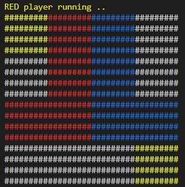

# The-L-game
Project about bot for automatic playing The L Game\
\
Authors: father (*Valdir*) and his son *Isaque Noll*

## Characteristics
- Automatic game playing "The-L-Game"
- Only console mode is supported
- Not interact with humans
- Use Python 2.7
- Use bots RED and BLUE
- Yellow color is a Neutral position
- White color is a void position
- Win when the other L doesn´t find new position

## Table is a matriz 4x4
    [a4 b4 c4 d4]
    [a3 b3 c3 d3] 
    [a2 b2 c2 d2]
    [a1 b1 c1 d1]

## The console image is similar to

